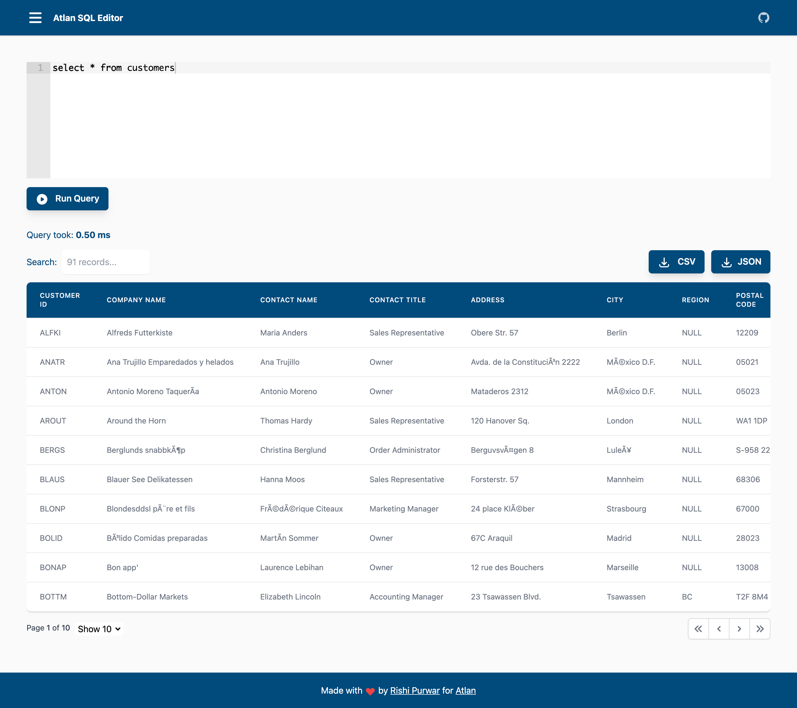

# 🚀 ATLAN SQL Editor

This is a ATLAN SQL Editor built using ReactJs and TailwindCSS.

## 👨‍💻 Demo

Try out the website : [ATLAN SQL Editor](https://atlan-react-sql-editor.netlify.app/)

## 👨‍🔧 Tech Stack

## 👨‍💻 Features

- [x] User can get data of any of the below SQL queries either by using Text Editor or Sidebar Menu.
- [x] User can filter data directly by clicking the Table Headers title.
- [x] User can search for a particular data using the search bar.
- [x] User can navigate to different pages using pagination.
- [x] User can download the data in both CSV and JSON Format in just one click.
- [x] User can see query runtime in milliseconds(ms).

## ✍️ Predefined SQL Queries

- `select * from customers`
- `select * from categories`
- `select * from employee_territories`
- `select * from order_details`
- `select * from orders`
- `select * from products`
- `select * from regions`
- `select * from shippers`
- `select * from suppliers`
- `select * from territories`

## ⏱ Page Load Time

## 🪜 Steps I took to optimize the page load time

- Used `React.Lazy()` to lazy load the component.
- Used `React.Memo()` to optimize the render performance of functional components.
- Used PurgeCSS to remove unused CSS.
- Used `gzipper` to further compress the JS and CSS Files.

## Available Scripts

In the project directory, you can run:

### `yarn start`

Runs the app in the development mode.\
Open [http://localhost:3000](http://localhost:3000) to view it in the browser.

The page will reload if you make edits.\
You will also see any lint errors in the console.

### `yarn build`

Builds the app for production to the `build` folder.\
It correctly bundles React in production mode and optimizes the build for the best performance.

The build is minified and the filenames include the hashes.\
Your app is ready to be deployed!

See the section about [deployment](https://facebook.github.io/create-react-app/docs/deployment) for more information.
